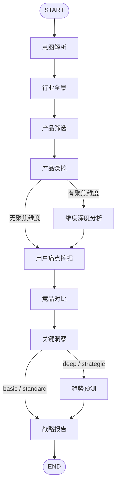

<div align="center">

# Deep Competitor Insight

> *互联网/科技行业竞品深度分析 — 十节点状态机，双语搜索，数据驱动洞察*

[](https://python.org)
[](LICENSE)
[](https://claude.ai/code)
[](https://openclaw.ai)
[](https://github.com/langchain-ai/langgraph)

<br>

一句话触发，自动采集中英文公开数据<br>
10 节点 LangGraph 工作流 × 2 条件路由 × 最多 45 次搜索<br>
输出结构化 JSON，由 AI 生成 9 章节专业竞品报告

[快速开始](#快速开始) · [工作流](#工作流) · [报告结构](#报告结构) · [安装](#安装) · [CLI](#命令行用法)

</div>

---

## 一句话说清楚

> 给我一个行业关键词，我给你一份可以直接汇报的竞品分析。

```
用户  ❯  帮我做一个海内外AI陪伴行业的竞品分析

deep-competitor-insight ❯
  🔍 意图解析: AI陪伴 | 深度: deep | 区域: 国内+海外
  🌐 行业全景: 市场规模 $263亿(2023) → $1408亿(2030), CAGR 32-39%
  📦 产品筛选: Character.AI / Replika / 猫箱 / 星野 / Talkie / EVE 等 8 个
  🔬 产品深挖: 定位 / 功能 / 商业模式 / 差异化 × 8
  😤 用户痛点: 平台关停数据丢失 / 内容安全 / 青少年依赖
  📊 竞品对比: 8 维度 × 8 产品矩阵
  💡 关键洞察: 5 条非显而易见的战略洞察
  📈 趋势预测: 多模态交互 / 监管收紧 / 硬件融合
  ✅ 49 次搜索, 146 个来源, 9 章节报告输出完成
```

---

## 工作流

基于 **LangGraph StateGraph** 的 10 节点状态机，2 个条件路由：



**条件路由逻辑：**
- 用户指定聚焦维度（如"会员设计"、"定价策略"）→ 额外执行维度深度分析节点
- 分析深度为 deep / strategic → 额外执行趋势预测节点

---

## 节点说明

| 节点 | 职责 | 搜索量 |
|:----:|------|:------:|
| 🎯 意图解析 | 从 query 中解析行业/范围/深度/聚焦维度 | 0 |
| 🌐 行业全景 | 搜索市场规模、竞争格局、赛道分层 | 3-5 |
| 📦 产品筛选 | 筛选头部/代表性/垂直/海外产品（最多 8 个） | 3-5 |
| 🔬 产品深挖 | 每个产品的定位/功能/商业模式/差异化 | 12-24 |
| 🎯 维度聚焦 | 用户指定维度的跨产品深度对比（条件触发） | 4-6 |
| 😤 用户痛点 | 真实用户吐槽、未满足需求、差评挖掘 | 3-6 |
| 📊 竞品对比 | 多维度对比矩阵（8 个维度） | 1-2 |
| 💡 关键洞察 | 竞争规律/壁垒/有效模式（纯聚合推理） | 0 |
| 📈 趋势预测 | 功能/用户/商业化趋势（条件触发） | 3-4 |
| 📋 战略报告 | 编译最终 JSON + 来源汇总 | 0 |

**总搜索量：** basic ~20 次 / standard ~25 次 / deep ~35 次 / strategic ~45 次

---

## 报告结构

脚本输出结构化 JSON，配合 Claude 推理生成 **9 大章节** 专业报告：

| 章节 | 内容 | 数据来源 |
|:----:|------|---------|
| 一 | 行业全景 — 市场规模、增速、赛道分层 | `landscape` |
| 二 | 竞品矩阵总览 — 产品定位图、tier 划分 | `products` |
| 三 | 产品深度拆解 — 每个产品的战略逻辑 | `product_profiles` |
| 四 | 聚焦维度分析 — 跨产品横向对比（条件） | `dimension_analysis` |
| 五 | 用户痛点与机会 — 痛点→机会映射 | `pain_points` |
| 六 | 多维度对比表 — 8 维度格式化矩阵 | `comparison` |
| 七 | 核心洞察 — 3-5 条非显而易见的战略洞察 | AI 推理 |
| 八 | 趋势预测 — 6-12 个月格局预判（条件） | `trends` + AI 推理 |
| 九 | 战略建议 — 可执行建议，关联具体证据 | 全量数据 + AI 推理 |

核心设计原则：**数据来自脚本，洞察来自 AI 推理。**

---

## 快速开始

```bash
# 安装依赖
pip install ddgs langgraph

# 标准分析
cd scripts && python3 competitor_analysis.py --query "AI陪伴行业竞品分析"

# 深度分析 + 指定聚焦维度
python3 competitor_analysis.py --query "短视频行业竞品分析" --depth deep --focus "商业模式"

# 战略级 + JSON 输出 + 详情
python3 competitor_analysis.py \
  --query "AI编程助手赛道分析" \
  --depth strategic \
  --region both \
  --format json \
  --verbose
```

---

## 命令行用法

| 参数 | 缩写 | 说明 | 默认值 |
|------|:----:|------|:------:|
| `--query` | `-q` | 用户查询（必填） | — |
| `--industry` | `-i` | 指定行业（覆盖自动解析） | 自动解析 |
| `--depth` | `-d` | 分析深度 | standard |
| `--focus` | | 聚焦维度（如"会员设计"） | 无 |
| `--region` | | 市场区域 | both |
| `--format` | `-f` | 输出格式 | json |
| `--verbose` | `-v` | 显示节点执行详情 | 关闭 |
| `--max-products` | | 最大分析产品数 | 8 |

### 深度说明

| 深度 | 搜索量 | 适用场景 |
|:----:|:------:|---------|
| basic | ~20 次 | 快速概览，"简单看看" |
| standard | ~25 次 | 日常调研，"分析一下" |
| deep | ~35 次 | 深度调研，"详细调研"，含趋势预测 |
| strategic | ~45 次 | 战略级，"给老板汇报"，全链路分析 |

### 区域说明

| 区域 | 说明 |
|:----:|------|
| cn | 仅搜索中文内容 |
| global | 仅搜索英文内容 |
| both | 中英文双语搜索，URL 去重合并 |

---

## 数据源

| 数据 | 来源 | 说明 |
|------|------|------|
| 网页搜索 | [DuckDuckGo](https://duckduckgo.com) via `ddgs` | 中英文双语，无需 API Key |
| 新闻搜索 | DuckDuckGo News | 行业新闻、趋势动态 |
| 数字提取 | 正则引擎 | 市场规模（亿元/$B）、用户数、增长率 |
| 产品名提取 | 正则 + 已知名单 | 中英文产品名、品牌识别 |

**搜索策略：** 每节点 3-6 次搜索，带 1 秒限速 + 指数退避重试（最多 3 次）

---

## 安装

### Claude Code

```bash
git clone https://github.com/CroTuyuzhe/deep-competitor-insight-skill.git ~/.claude/skills/deep-competitor-insight-skill
pip install ddgs langgraph
```

### OpenClaw

```bash
git clone https://github.com/CroTuyuzhe/deep-competitor-insight-skill.git ~/.openclaw/workspace/skills/deep-competitor-insight-skill
pip install ddgs langgraph
```

触发词（自动识别）：
- "竞品分析"、"竞争分析"、"行业分析"、"竞品对比"
- "分析XX行业"、"XX赛道分析"、"帮我做竞品调研"
- "competitive analysis"

---

## 项目结构

```
deep-competitor-insight-skill/
├── SKILL.md                      # Skill 入口 & 报告生成指南
├── README.md
├── LICENSE
├── requirements.txt              # ddgs, langgraph
└── scripts/
    ├── competitor_analysis.py    # LangGraph 主图：10 节点 + 2 条件路由 + CLI
    └── web_search.py             # DuckDuckGo 搜索封装：重试、限速、双语、提取
```

---

## 输出示例

```json
{
  "meta": {
    "query": "AI陪伴行业竞品分析",
    "industry": "AI陪伴",
    "depth": "deep",
    "total_searches": 49,
    "errors": []
  },
  "landscape": {
    "raw_snippets": "...",
    "market_numbers": [{"value": "263", "unit": "$B", "context": "..."}],
    "key_players_mentioned": ["Character.AI", "Replika", "..."]
  },
  "products": [{"name": "...", "region": "global", "source_mentions": 5}],
  "product_profiles": [{"name": "...", "raw_snippets": "...", "market_numbers": []}],
  "pain_points": {"raw_snippets": "...", "result_count": 29},
  "comparison": {"dimensions": ["目标用户", "核心功能", "..."], "products": ["..."]},
  "insights": {"products_overview": [{"name": "...", "data_richness": 2010}]},
  "trends": {"raw_snippets": "...", "result_count": 22},
  "sources": ["来源1 (url)", "来源2 (url)", "...共146个"]
}
```

---

## 注意事项

- 搜索数据来自公开网络，可能存在时效性和准确性限制
- 洞察和趋势判断基于 AI 推理，非确定性结论
- 若 DuckDuckGo 搜索受限，部分节点可能数据不足，报告会标注
- 产品名自动提取存在噪声，AI 报告生成阶段会修正
- 结论仅供研究参考，重大商业决策请结合更多信源验证

---

<div align="center">

MIT License © [Eric](https://github.com/CroTuyuzhe)

</div>
